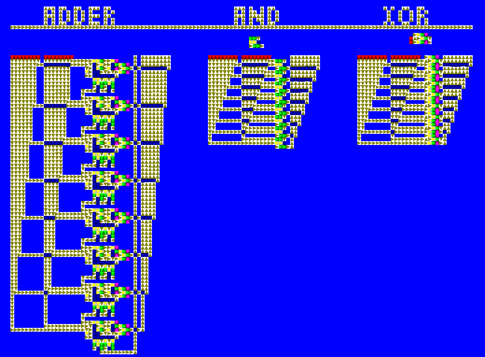

# Elecsim: A pulse simulation with the goal of creating logic circuits

Elecsim is a tile-based logic simulation, and intended to be game, not an actual electronics simulator. It is written in C++ and is cross-platform compatible.

Below, you can see some of the things you can build with Elecsim.



## Building the project

Since this project uses SFML, if you're using Linux, you will be required to install [the dependencies needed by it.](https://www.sfml-dev.org/tutorials/3.0/getting-started/build-from-source/#installing-dependencies)

The dependencies required for NFDE [can be found here](https://github.com/btzy/nativefiledialog-extended?tab=readme-ov-file#linux)

This project is built using CMake, so prepare a build directory and configure it.

```
mkdir build

cd build

cmake ..
```

At certain points, the configuration may freeze. This is normal as the program is fetching the required dependencies. 

If you'd like to use the the old way of processing tile updates, pass along ```-DSIM_PREPROCESSING=OFF``` after the initial configuration has completed.

Furthermore, you can turn off LTOs and CCache (if available) by using ```-DDISABLE_LTO=ON``` and ```-DDISABLE_CCACHE=ON```.

If you are using Linux and you are on the debug configuration and want to use the address sanitizer, youc an pass ```-DENABLE_MEMCHECK```

To compile the project, all you must do after this is issue the following command: 

```cmake --build .```

Naturally, you may want to configure cmake with a built type as well. 

The compiled binaries can be found in the newly created "bin" directory. 

## Using the program

The controls are as follows: 
  - 1-7: Select your tile. The order is: Wire, Junction, Emitter, Semiconductor, Button, Inverter, Crossing. Replaces the buffer.
  - Up, Down, Left, Right (Or WASD): Move the camera
  - Mousewheel Up: Zoom in
  - Mousewheel Down: Zoom out
  - F: Reset the Camera to the default position and the default render scaleds
  - F2: Save file to disk
  - F3: Load file from disk
  - Comma: Speed up the update rate
  - Period: Slow down the update rate
  - R: Change the facing of the tile you are about to place
  - Z: Clear the tile buffer
  - Space: Toggle between build and simulation mode
  - Left Mouse Button (while the simulation is paused): Place the buffer at the current position
  - Left Mouse Button (while the simulation is running): Interact with certain tiles (Button, Semiconductor and Emitter)
  - Right Mouse Button (while the simulation is paused): Erase a tile
  - Middle Mouse Button: Pan the camera around.
  - Ctrl (hold): Start a selection
  - Ctrl+C: Copy the tiles within the selection into the buffer
  - Ctrl+X: Cut the tiles within the selection into the buffer
  - Ctrl+V: Paste the tiles in the buffer onto the grid based on the mouse's position (So it does the same thing as LMB)
  - Escape: Close the game

### Tile behavior

Wire: Take inputs from any side but the one it is facing, and forward them in the direction it is facing.

Junction: Take inputs from any side, and spread it in all directions excluding the one where it came from.

Emitter: While active, keep pulsing. It changes states every tick.

Semiconductor: When activated from the side, it gets primed. Then, an activation from the bottom will cause it to emit a pulse in the direction it's facing.

Button: Does nothing, unless interacted with, in which case it will pulse once.

Inverter: Does what the name implies, and inverts a signal, outputting it in the direction of the facing.

Crossing: Takes one input from one side, and puts it out the other. This allows wires to cross. Get messy!

### Examples
There are files in the "examples subdirectory to demonstrate the function of the different components. 

stresstest.grid: Attempts to draw a large amount of tiles. (Does not stresstest simulation speeds)

componentGallery.grid: Contains multiple more complex circuits, such as an 8-bit adder, XOR and AND-Gate. (See the image above.)

## ToDos
Sorted in order of how important I deem them to the proper function of the game.
  - Add editing tools: Area selection, copy, cut, paste, move around (DONE!)
  - Add a crossing tile to allow for more flexible building. (DONE!)
  - Implement Signal Path Preprocessing (DONE!)
  - Write more tests (DONE!)
  - Detach libElecSim from the PixelGameEngine. (DONE!)
  - Draw Sprites for the tiles instead of just drawing them out of primitives (DONE! Actually, we draw tilemap chunks now.)
  - Stop using shared pointers everywhere
  - Dispatch game logic to another thread so there's more time to render for more tiles
  - Implement compression for save files


# Credits

Massive thanks go out to these outstanding projects! Without them, this would have been a whole lot harder to actually get done.

  - [Native File Dialog Extended](https://github.com/btzy/nativefiledialog-extended) by Bernard Teo
  - [PixelGameEngine](https://github.com/OneLoneCoder/olcPixelGameEngine) by Javidx9, which has been used in the initial development phase.
  - [SFML](https://www.sfml-dev.org/) by many, many people in their community

## License

This project is licensed under the MIT License - see the [LICENSE](LICENSE) file for details.

### Third-Party Licenses

This project uses third-party software with different licenses. See [THIRD_PARTY_LICENSES](THIRD_PARTY_LICENSES) for complete license information of all dependencies.